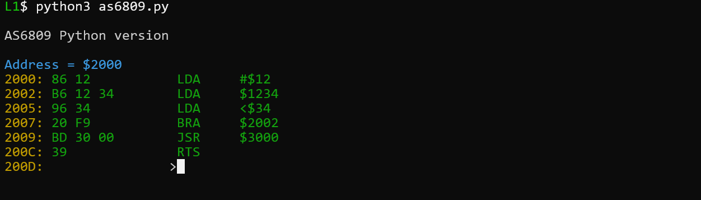
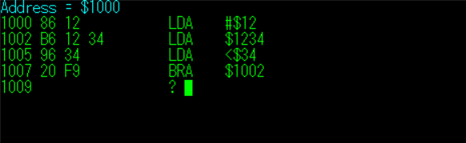

# AS6809

A 6809 one-pass assembler written in N88-BASIC(86), preserved in its original form,\
with an additional modern Python companion implementation.

---

## Overview

AS6809 is a compact one-pass assembler for the Motorola 6809 CPU, written entirely in BASIC.

It generates machine code interactively: each instruction is entered line by line, and the resulting bytes are displayed immediately together with the current address.

This repository preserves the original PC-9801 N88-BASIC(86) version, which itself was derived from an earlier FM-new7 implementation.

A modern Python rewrite is also included as a readable companion implementation that follows the structure and spirit of the original program.

### Interactive Python Version

Interactive assembly in action:



---

## Features

### Original BASIC Version

- One-pass interactive assembler  
- Immediate machine code output  
- Automatic address increment  
- Supports common 6809 instructions  
- Multiple addressing modes  
- Compact implementation written entirely in BASIC  
- Color text user interface  
- Designed for responsive operation even in a BASIC environment  

### Python Companion Version

- Clean, readable modern implementation  
- Table-driven opcode structure mirroring the BASIC version  
- Immediate machine code generation after each input line  
- Supports many 6809 instructions and addressing modes  
- Useful as a study reference for the original design  
- Preserves the “interactive one-pass” philosophy  

---

## Typical Usage (BASIC Version)



1. Run the program in N88-BASIC(86)  
2. Enter a start address  
3. Type assembly instructions line by line  
4. Machine code is generated immediately  
5. Continue assembling interactively  

Example:

```asm
Address = $1000
1000 86 12        LDA #$12
1002 B6 12 34     LDA $1234
1005 96 34        LDA <$34
1007 20 F9        BRA $1002
```

Even on the original BASIC environment, the program was designed to respond immediately after pressing ENTER, making it practical as an interactive assembler.

---

## Python Companion Implementation

A modern rewrite (as6809.py) is included.

This version is not a line-by-line translation of the BASIC program.\
Instead, it is designed as a readable, structurally faithful companion that:

- Keeps the original one-pass interactive workflow
- Uses table-driven opcode definitions similar to the BASIC DATA tables
- Implements addressing modes in a clear, structured way
- Generates machine code immediately after each line
- Helps readers understand the original program’s internal logic

It intentionally retains several limitations of the BASIC version:

- No labels or symbol table
- No object file output
- Simple numeric expressions only

This makes it a practical reference for studying the original design.

---

## Background

AS6809 was originally created during student years.

A friend had purchased an FM-new7 and wanted to learn assembly programming.\
Since an assembler was needed, a simple 6809 assembler was written overnight in BASIC.

At the time, the Motorola 6809 was a new and interesting CPU to explore.

Later, the program was ported to PC-9801 N88-BASIC(86).\
The version preserved here is that later port.

The Python rewrite included in this repository was created in 2026 as a modern companion implementation,\
intended to document and clarify the structure of the original BASIC program.

---

## Implementation Notes (BASIC Version)

The original program uses classic BASIC techniques:

- DATA statements for opcode tables
- String parsing for instruction decoding
- Addressing mode classification
- Relative branch offset calculation
- Compact table-driven logic

To achieve practical performance in BASIC, the program:

- Preloads opcode tables at startup
- Dispatches instruction handling early in the parsing process
- Minimizes unnecessary loops and repeated comparisons

These design choices help maintain smooth interactive response even on limited hardware.

---

## Known Issues (Preserved for Authenticity)

The BASIC source code is preserved exactly as originally written.

Some likely typographical mistakes are known:

- Line 160: possible typo in loop condition
- Line 45040: `DUBB` is likely intended to be `SUBB`

These are intentionally left unchanged for historical preservation.\
Interestingly, the assembler still operates correctly in normal use.

---

## Notes

- Intended for PC-9801 N88-BASIC(86) environment
- Originally derived from an FM-new7 version
- Python version included as a modern study reference
- Preserved for historical and technical interest

---

## Status

This repository preserves the original implementation\
and provides a modern companion rewrite for educational purposes.

---

## License

MIT License


